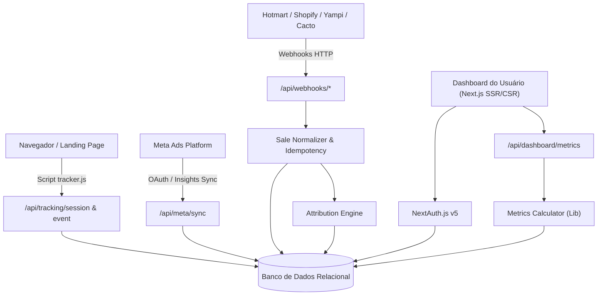
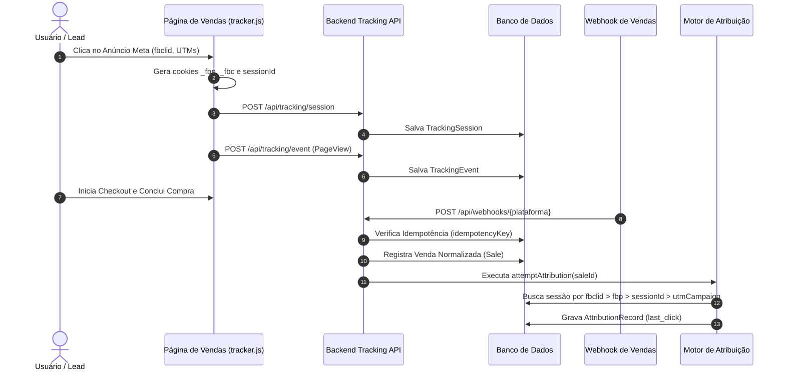

# Arquitetura do Sistema — UTM-Track

## 1. Visão Geral Arquitetural

O UTM-Track foi concebido sob o modelo **Modular Multi-Tenant**, permitindo escalabilidade imediata para centenas de contas e clientes comerciais mantendo rigoroso isolamento de dados.

---

## 2. Isolamento Multi-Tenant

A estrutura de isolamento opera em 3 níveis:

1. **User**: Usuário cadastrado no sistema com credenciais seguras (bcrypt).
2. **Workspace**: Unidade central de posse dos dados (contas de anúncio, pixels, vendas, regras, despesas).
3. **WorkspaceMember**: Tabela associativa com permissões (`owner`, `admin`, `member`).

Toda requisição para API passa pelo helper `getUserWorkspaceId(session.user.id)` garantindo que dados de outros workspaces sejam inacessíveis.

---

## 3. Fluxo de Tracking e Atribuição

---

## 4. Segurança de Chaves e Credenciais

- **Criptografia Simétrica**: Chaves privadas e tokens de acesso são cifrados com **AES-256-GCM** via `src/lib/encryption.ts`.
- **Derivação de Chave**: Utiliza uma chave mestra de 32 bytes (`ENCRYPTION_KEY`) definida no servidor.
- **Mascaramento no Client**: Na interface do usuário, apenas os últimos 4 dígitos de qualquer token salvo são visíveis.
- **Proteção contra Replay**: Todo webhook recebido gera um identificador único no formato:
  `{plataforma}_{idTransacao}_{status}`
  Se a chave já existir na tabela `WebhookEvent`, a requisição retorna `200 OK` imediatamente sem duplicar dados.

---

## 5. Escalabilidade de Banco de Dados

- **Ambiente de Desenvolvimento**: SQLite local com arquivo `dev.db` para inicialização com zero configuração externa.
- **Ambiente de Produção**: PostgreSQL com pool de conexões (Supabase, Neon, AWS RDS). A migração requer apenas alterar a variável `DATABASE_URL` no `.env` e o provider em `schema.prisma`.
- **Índices de Alta Eficiência**:
  - `TrackingSession`: índices em `[workspaceId, firstSeenAt]`, `[fbclid]`, `[fbp]`, `[utmCampaign]`.
  - `Sale`: índices em `[workspaceId, status]`, `[workspaceId, orderedAt]`, `[utmCampaign]`.
  - `WebhookEvent`: índices em `[workspaceId, idempotencyKey]`, `[workspaceId, receivedAt]`.
