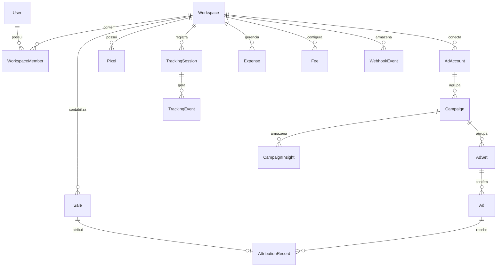

# Dicionário e Estrutura do Banco de Dados — UTM-Track

O banco de dados do UTM-Track foi modelado com **Prisma ORM** e estruturado para alta performance de consultas analíticas e integridade relacional com chaves estrangeiras e índices compostos.

---

## 1. Diagrama Entidade-Relacionamento Resumido

---

## 2. Tabelas e Entidades Principais

### Autenticação & Multi-tenant
- `User`: Cadastro de usuários e credenciais de acesso (`password` protegido com bcrypt).
- `Workspace`: Espaço de trabalho isolado para cada cliente ou projeto.
- `WorkspaceMember`: Associação entre usuário e workspace com papéis (`owner`, `admin`, `member`).

### Meta Ads
- `AdAccount`: Contas de anúncios conectadas da Meta (`externalId`, `accessTokenEnc`, `currency`, `timezone`).
- `Campaign`: Campanhas de anúncios (`externalId`, `name`, `status`, `objective`, `dailyBudget`).
- `AdSet`: Conjuntos de anúncios (`externalId`, `name`, `status`, `optimizationGoal`, `dailyBudget`).
- `Ad`: Anúncios individuais (`externalId`, `name`, `status`, `previewUrl`).
- `CampaignInsight`: Snapshots diários de desempenho sincronizados via Meta API (`spend`, `impressions`, `reach`, `clicks`, `ctr`, `cpc`, `cpm`, `conversions`).

### Tracking & UTMs
- `TrackingSession`: Sessões iniciadas por visitantes (`sessionId`, `visitorId`, `utmSource`, `utmMedium`, `utmCampaign`, `utmContent`, `utmTerm`, `fbclid`, `fbp`, `fbc`, `landingPage`, `referrer`).
- `TrackingEvent`: Eventos disparados na navegação (`eventName`, `eventId`, `value`, `currency`, `orderId`, `status`, `capiResponse`).
- `UtmLink`: Links rastreáveis gerados pelo usuário (`destinationUrl`, `fullUrl`, `clicks`).
- `Pixel`: Configuração de Meta Pixels e tokens CAPI (`pixelId`, `accessTokenEnc`, `environment`).

### Vendas & Atribuição
- `Sale`: Vendas unificadas de qualquer canal (`platform`, `externalId`, `status`, `grossAmount`, `netAmount`, `orderedAt`, `approvedAt`).
- `AttributionRecord`: Relacionamento analítico entre Venda e Anúncio/Campanha (`model`, `confidence`, `matchedBy`, `fbclid`, `utmCampaign`).

### Finanças & Operação
- `Expense`: Despesas operacionais cadastradas (`name`, `category`, `amount`, `recurrence`, `date`).
- `Fee`: Taxas de gateway e checkout (`percentage`, `fixedAmount`, `type`, `platform`).
- `WebhookEndpoint`: Endpoints de webhooks genéricos (`endpointId`, `secret`, `eventCount`).
- `WebhookEvent`: Fila de eventos brutos recebidos para auditoria e reprocessamento com chave de idempotência (`idempotencyKey`, `source`, `payload`, `status`).
- `Notification`: Sistema de alertas de vendas, erros de integração e anomalias de ROI/CPA.
- `SyncLog`: Histórico de sincronizações de anúncios e conciliações.
